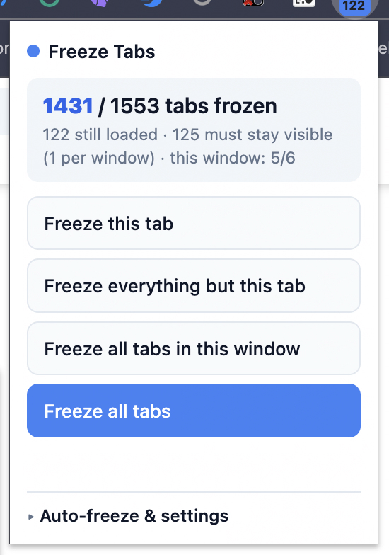

# Freeze Tabs

> made this cuz i needed to freeze 1400 tabs

`remake your own extensions #ownit`

A tiny **Manifest V3** Chrome extension that freezes tabs (unloads them from memory)
— on click, or automatically when they go idle. By default it can't read your URLs,
titles, or page content.

## What it does

Click the toolbar icon → four buttons:

| Button | Freezes |
| --- | --- |
| **Freeze this tab** | the tab you're on (hops to a neighbor first — Chrome won't unload the visible tab) |
| **Freeze everything but this tab** | every other tab, across all windows |
| **Freeze all tabs in this window** | just this window |
| **Freeze all tabs** | everything, including the current one |

"Freeze" = `chrome.tabs.discard()`: the page drops out of memory but stays in the
strip and reloads the moment you click back to it. The popup shows a live
`frozen / total` count and a badge, so you can actually watch it work.

## Auto-freeze & settings (v1.3.0)

Open the settings panel in the popup:

- **Auto-freeze idle tabs** after N minutes — a once-a-minute alarm scans for stale
  tabs (MV3-correct, survives the service worker sleeping).
- **Pin = never freeze.** Pin your Gmail / music / calendar tab and auto-freeze
  leaves it alone. Using *pinned* as the whitelist is deliberate: a URL-based
  whitelist would need permission to read every tab's address, which is the exact
  thing I didn't want this extension to have.
- **Skip tabs playing audio.**
- **Protect tabs with unsaved text** *(optional, off by default)* — only if you
  flip this on does it ask for `scripting` access to peek a tab for typed-in form
  text and skip freezing it.
- **Keyboard shortcuts** — freeze this (`⌘/Ctrl+Shift+E`), freeze all
  (`⌘/Ctrl+Shift+Y`). Rebind at `chrome://extensions/shortcuts`.

## Permissions (this is the point)

Default permissions are just **`alarms`** and **`storage`**. **No `tabs` permission,
no host access** — so it literally can't see your URLs, titles, or pages. It reads
tab *ids* and the non-sensitive `pinned` / `audible` / `active` flags, and
`tabs.discard` itself needs no permission. The only way it ever gets more is if *you*
turn on unsaved-text protection. Everything extra lives under `optional_permissions`
in `manifest.json` — check it yourself.

## Install (load unpacked)

1. Open `chrome://extensions`
2. Toggle **Developer mode** on (top-right)
3. Click **Load unpacked** and pick this folder
4. Pin it from the puzzle-piece menu

## Nerdy bits it handles

- `discard()` swaps in a fresh tab with a **different id**, so freezes are counted by
  the *net change* in discarded tabs, not by tracking old ids (which would throw).
- Every window keeps one visible tab that can't be discarded, so "freeze all" hops
  focus to a neighbor first.
- Freezing runs in chunks of 40 so it stays reliable across ~1400 tabs and dozens of
  windows.

---

  
  
  

<strong>Built by Zayd Khan // cold</strong> (<a href="https://twitter.com/ColdCooks">@ColdCooks</a> / <a href="https://github.com/zaydiscold">zaydiscold</a> / <a href="https://zayd.wtf">zayd.wtf</a>).

---

> **`*** SYSTEM NOTIFICATION ***`**
>
> Congratulations, Operator. You reached the bottom of the README — most had it discarded from memory three screens ago.
>
> *Achievement unlocked — "Cold Storage."* You hold a zero-permission kill switch for 1,400 tabs of your own hoarding. The System notes your RAM fans have stopped screaming.
>
> *A browser is only as fast as the tabs you're willing to let go of. Freeze on purpose.*
>
> **Loot dropped:** one (1) tiny MV3 extension that never once read your URLs. *Discard freely. Reload on focus. Try not to open 1,553 more.*

<!-- Zayd Khan // cold // www.zayd.wtf -->
